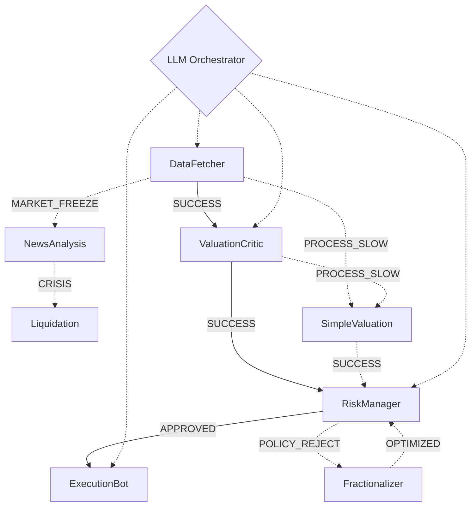

# 💰 FinSense: Level 5 Autonomous Quant Analyst System

[](https://www.python.org/downloads/)
[](https://opensource.org/licenses/MIT)
[](https://groq.com/)

**FinSense** is a production-grade Multi-Agent System (MAS) designed for high-frequency quantitative finance. It utilizes a dynamic **LLM Orchestrator** to manage a team of specialized agents, achieving **Level 5 Autonomy** through self-correction and automated failure handling.

---

## 🧠 System Architecture: The "Hub-and-Spoke" Model

Unlike traditional trading bots, FinSense does not follow a linear script. It uses a central **Orchestrator Agent** that monitors every step of the pipeline and autonomously decides the next course of action based on market conditions and agent outputs.



### 🤖 The Agent Team
- **DataFetcher**: High-speed market data retrieval and summarization.
- **ValuationCritic**: Quantitative fundamental analysis and BUY/SELL recommendations.
- **RiskManager**: Institutional compliance engine enforcing VAR and notional limits.
- **ExecutionBot**: Smart-order routing and automated trade execution.
- **Self-Correction Suite**: 
  - `Fractionalizer`: Resizes rejected trades for compliance.
  - `NewsAnalysis`: Diagnoses market freezes (Black Swan detection).
  - `Liquidation`: Urgent de-risking during confirmed crises.
  - `SimpleValuation`: Low-latency backup for slow models.

---

## 🛡️ Autonomous Self-Healing Workflows

FinSense is built to handle the "Edge Cases" that crash standard systems:

1. **Strategic Failure (Policy Reject)**: If the `RiskManager` rejects a trade for being too large, the Orchestrator reroutes to the `Fractionalizer` to optimize the size and resubmit.
2. **Market Failure (Market Freeze)**: Upon detecting a halt, the system activates `NewsAnalysis`. If a crisis is confirmed, `Liquidation` is triggered; otherwise, it resumes via a technical fallback.
3. **Process Failure (Latency Error)**: If the primary `ValuationCritic` takes >5 seconds, the system automatically swaps in the heuristic `SimpleValuation` agent to ensure execution timing.

---

## 🚀 Tech Stack & Reliability

- **Inference**: [Groq LPU](https://groq.com/) using `Llama-3.3-70B` for sub-second agent reasoning.
- **Schema**: Strict Pydantic validation for all agent communications.
- **Async**: Fully asynchronous execution pipeline (`asyncio`).
- **UI**: High-fidelity "War Room" dashboard built with [Gradio](https://gradio.app/).
- **Validation**: Institutional-grade prompts with multi-status logic.

---

## ⚙️ Installation & Usage

### 1. Clone & Install
```bash
git clone https://github.com/LVVignesh/FinSense-Quant-Agent.git
cd FinSense-Quant-Agent
pip install -r requirements.txt
```

### 2. Configure Environment
Create a `.env` file in the root directory:
```text
GROQ_API_KEY=your_groq_key_here
MOCK_MODE=False   # Set to True to run without an API key
```

> **Note:** `MOCK_MODE=False` requires a valid `GROQ_API_KEY` from [console.groq.com](https://console.groq.com/).  
> Set `MOCK_MODE=True` to test the full pipeline logic without any API key.

### 3. Launch Dashboard (or use Docker)
```bash
python main.py
```

---

## 📄 License

This project is licensed under the MIT License - see the [LICENSE](LICENSE) file for details.
